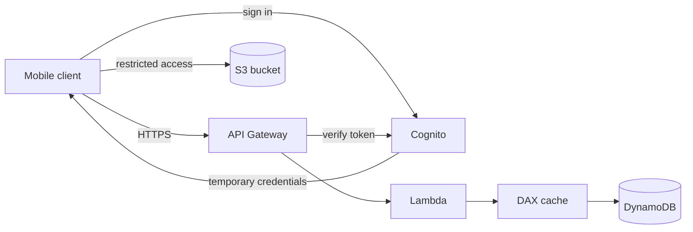

# Serverless Solution Architectures

Concept-only note merged from chapter 20. Same content in chapter order: [[20 - Serverless Solution Architecture Discussions]] (Version B). Building blocks: [[Lambda]], [[API Gateway, Step Functions & Cognito]], [[DynamoDB]].

## 1. Mobile app "MyTodoList"
(src: 20/01-Mobile Application- MyTodoList)
Requirements: REST API over HTTPS, serverless, users access **their own folder in S3**, managed serverless authentication, mostly **reads**, database must scale with high read throughput.

- Base design: mobile client -> **API Gateway** (REST/HTTPS) -> **Lambda** -> **DynamoDB**. **Cognito** authenticates the client and API Gateway verifies it with Cognito.
- **S3 access for users**: client authenticates to Cognito, which returns **temporary credentials** (identity pool); with them the client reads/writes its own S3 space under a restricted policy.
- Reads dominate and rarely change -> **DAX** in front of DynamoDB (cache reads, fewer RCUs, lower cost), and/or **API Gateway response caching** for static answers.

> [!info] Diagram
> **Explanation:** API Gateway fronts a Lambda logic tier that reads/writes DynamoDB (through DAX for cached reads); Cognito authenticates users and issues temporary credentials so the client talks to S3 directly. It is the lecture's design drawn as a serverless three-tier application.
> **Reference:** [Serverless Multi-Tier Architectures with Amazon API Gateway and AWS Lambda (AWS Whitepaper, historical reference)](https://docs.aws.amazon.com/whitepapers/latest/serverless-multi-tier-architectures-api-gateway-lambda/introduction.html)

> [!tip] Exam
> Wrong answer: store AWS user credentials in the mobile app. Right answer: **Cognito temporary credentials**. Read-heavy DynamoDB = **DAX**; static API responses = **API Gateway cache**.

## 2. Serverless website "MyBlog.com"
(src: 20/02-Serverless Website- MyBlog.com)
Requirements: global scale, mostly reads, static content plus a small dynamic REST API, caching, **welcome email** for new subscribers, **thumbnails** for uploaded photos, all serverless.

- **Static global content**: S3 + **CloudFront** (edge caching). **Secure** it with **Origin Access Control (OAC)** and a **bucket policy** that only allows the CloudFront distribution; direct S3 access is denied ([[CloudFront & Global Accelerator]], [[S3 Security & Encryption]]).
- **Dynamic API**: REST/HTTPS -> API Gateway -> Lambda -> DynamoDB, with **DAX** for read caching. For global reads use **DynamoDB Global Tables** (Aurora Global Database would work but is not serverless, it is provisioned).
- **Welcome email**: **DynamoDB Streams** on the users table -> **Lambda** with an IAM role allowing **Amazon SES** (Simple Email Service) -> sends the email through the SDK.
- **Thumbnails**: client uploads to S3 (directly, or via CloudFront / **S3 Transfer Acceleration**) -> S3 event triggers **Lambda** -> thumbnail saved to another bucket. S3 can also notify **SQS** or **SNS** instead.

> [!tip] Exam
> No Cognito needed for a fully public REST API. Static + global = S3 + CloudFront + OAC. Reacting to table changes = DynamoDB Streams + Lambda.

## 3. Microservices
(src: 20/03-MicroServices Architecture)
- Goals: **leaner development lifecycle** per service, **independent scaling**, own code repository per service. Each microservice may use a **different architecture** (the lecture mixes ELB + ECS + DynamoDB; API/Lambda + ElastiCache; ELB + ASG + EC2 + RDS), each with its own DNS name (e.g. `service1.example.com` through [[Route 53]]).
- **Synchronous pattern**: direct calls through **API Gateway** or a **load balancer** (HTTPS).
- **Asynchronous pattern**: **SQS, SNS, Kinesis, Lambda triggers, S3 events**; caller does not wait for a response.
- Challenges: overhead per new service, server density/utilization, running multiple versions at once, client-side code needed to integrate with many services.
- Serverless patterns help: API Gateway + Lambda **scale automatically and bill by usage** (no utilization worry), APIs/environments are easy to **clone**, **client SDKs** can be generated through Swagger.

> [!tip] Exam
> Microservices are a **design**, not a service; both sync (API Gateway, ELB) and async (SQS, SNS, Kinesis) integration patterns apply. See [[SQS]], [[SNS]], [[Kinesis & Firehose]], [[Containers (ECS, ECR, EKS)]].

## 4. Software updates distribution
(src: 20/04-Software updates distribution)
- Scenario: updates served from EC2 behind an **ELB + ASG** (files on **EFS**) cause heavy cost and CPU at release time; **do not re-architect**.
- Fix: put **CloudFront** in front. Update files are **static**, so they are cached at the edge; the ASG scales less, saving EC2, network and EFS costs, with better availability and no architectural change.

> [!tip] Exam
> Mostly static content served at scale from an existing app = **CloudFront caching** as the simplest, cheapest improvement. See [[ELB]], [[ASG]], [[EFS]].

## Not included here
- All four lectures of chapter 20 have transcripts; nothing dropped except chatter. SES is explained in [[Messaging & Mobile Services]].
