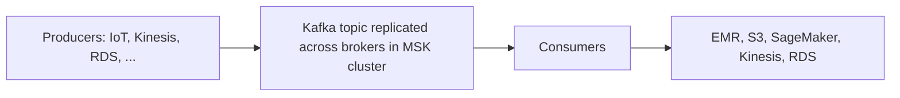

# Streaming Analytics - Flink & MSK

Concept-only note. Lab steps: [[22 - Data & Analytics]] (Version B). Related: [[Kinesis & Firehose]].

## 1. Amazon Managed Service for Apache Flink
(src: 22/09-Amazon Managed Service for Apache Flink, 22/10-Amazon Managed Service for Apache Flink - Hands On)
- Formerly **Kinesis Data Analytics for Apache Flink**; renamed to Managed Service for Apache Flink.
- **Flink** = framework (Java, SQL, Scala) for **real-time processing of data streams**.
- Runs any Flink application on a managed cluster: AWS provisions compute, **parallel computation**, **automatic scaling**, and manages application **backups as checkpoints and snapshots**. Any Flink-supported programming feature may transform the data.
- Sources: **Kinesis Data Streams** and **Amazon MSK**. **It cannot read from Firehose** (possible exam trick).
- Console options (overview only): streaming application (Flink, choose runtime version, upload your app, monitor via Flink dashboard) and Studio notebooks; a legacy **SQL applications** option exists (the way to read from Firehose); recommended path is Studio / Flink.

> [!tip] Exam
> Flink = stream processing only. Reads Kinesis Data Streams / MSK, not Firehose. Not needed beyond this level.

## 2. Amazon MSK (Managed Streaming for Apache Kafka)
(src: 22/11-MSK - Managed Streaming for Apache Kafka)
- **Kafka** = alternative to Kinesis for streaming data. MSK = **fully managed Kafka**: create, update, delete clusters; creates and manages **broker nodes** and **ZooKeeper nodes**.
- Deployed **in your VPC**, **multi-AZ up to 3** for HA; automatic recovery from common Kafka failures; data stored on **EBS** for as long as you want.
- **MSK Serverless**: run Kafka without provisioning servers or managing capacity; MSK scales compute and storage automatically.

> [!info] Diagram
> **Explanation:** Producers write to a Kafka topic that is replicated across brokers; consumers pull from the topic and forward data to downstream services. MSK manages the brokers (and ZooKeeper) inside your VPC.
> **Reference:** [What is Amazon MSK? (Amazon MSK Developer Guide)](https://docs.aws.amazon.com/msk/latest/developerguide/what-is-msk.html)

[verify] MSK creates and manages ZooKeeper nodes.
> [!warning] Correction [note]
> AWS docs say MSK creates ZooKeeper nodes for you, and also supports **KRaft controllers** (the Kafka replacement for ZooKeeper, included at no extra cost). Source: [What is Amazon MSK?](https://docs.aws.amazon.com/msk/latest/developerguide/what-is-msk.html).

### Kinesis Data Streams vs MSK
| | Kinesis Data Streams | Amazon MSK |
|---|---|---|
| Message size | **1 MB** limit | **1 MB default**, configurable higher (e.g. **10 MB**) |
| Structure | **Shards** | **Topics with partitions** |
| Scaling | shard **split** / **merge** | can only **add partitions**, never remove |
| In-flight encryption | TLS | **PLAINTEXT or TLS** |
| At-rest encryption | yes | yes (KMS) |
| Retention | up to 1 year | as long as you want (even over 1 year) if you pay for EBS storage |

### Consuming from MSK
Producer = Kafka producer you write. Consumers: **Flink** app (Managed Service for Apache Flink), **Glue streaming ETL** (Spark Streaming), **Lambda** with MSK as event source, or your own Kafka consumer on **EC2 / ECS / EKS**. See [[Containers (ECS, ECR, EKS)]].

> [!tip] Exam
> Apache Kafka -> MSK. Know the Kinesis vs MSK differences above.

## 3. Big data ingestion pipeline (serverless)
(src: 22/12-Big Data Ingestion Pipeline)
Goal: fully serverless, managed pipeline: collect in real time, transform, query with SQL, store reports, load a warehouse, build dashboards.

- IoT Core harvests data from many devices; Kinesis = real-time collection; **Firehose = near-real-time delivery to S3, one minute is the lowest buffer interval** [verify]; Lambda can transform in Firehose; S3 can notify **SQS, SNS or Lambda**; Athena is serverless SQL with results back to S3; reporting buckets feed QuickSight or Redshift.
> [!warning] Correction [note]
> Unconfirmed: the "1 minute minimum" is the instructor's statement and no AWS page was fetched to verify it; Firehose buffering settings may have changed.

## Not included here
- Hands-on narration of 22/10 (console tour). Kinesis Data Streams / Firehose concepts: [[Kinesis & Firehose]]. Athena, Glue: [[Athena, Glue & Lake Formation]]; Redshift, QuickSight: [[Redshift, EMR, OpenSearch & QuickSight]].
