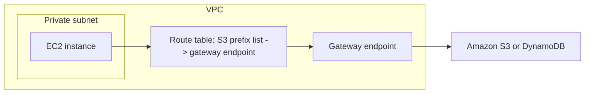
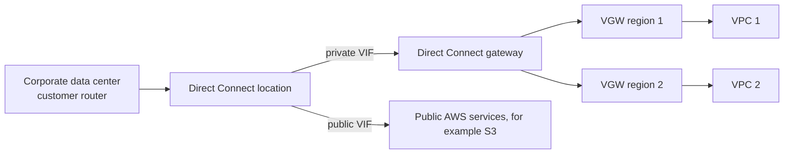
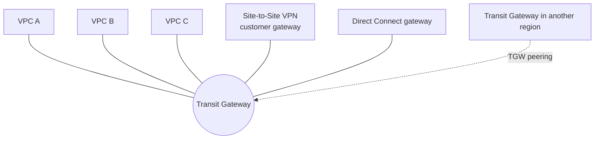

# VPC Connectivity

Concept-only note covering how a VPC connects to other VPCs, AWS services and on-premises networks: peering, endpoints, Site-to-Site VPN, Direct Connect and Transit Gateway. Lab steps are in [[27 - Networking - VPC]] (Version B). VPC basics (CIDR, subnets, route tables, NAT) are in [[VPC]].

## 1. VPC Peering
(src: 27/19-VPC Peering, 27/20-VPC Peering Hands On)
- Connects two VPCs over the **AWS network** so they behave as if in the same network. Works **across regions, across accounts**, or within one account.
- **CIDRs must not overlap**, otherwise the peering cannot be created / VPCs cannot communicate.
- **Not transitive**: A-B and B-C peered does **not** let A talk to C; you need an explicit A-C peering.
- Must **update the route tables** in the subnets of **both** VPCs (destination = other VPC CIDR, target = peering connection). Without routes there is a timeout even though peering is active.
- A peering request must be **accepted** by the accepter VPC owner (pending acceptance state).
- You can **reference a security group of a peered VPC** (across accounts, same region) instead of using a CIDR.
- Private IPs are the only way across (the two VPCs are isolated otherwise).

> [!tip] Exam
> Peering = non-transitive + no overlapping CIDRs + route tables on both sides.

## 2. VPC Endpoints (AWS PrivateLink)
(src: 27/21-VPC Endpoints, 27/22-VPC Endpoints Hands On)
- Every AWS service has a public URL. Without endpoints, private instances reach services (e.g. SNS, DynamoDB, S3, CloudWatch) via **NAT gateway -> internet gateway**: costly and many hops.
- A **VPC endpoint** lets instances reach AWS services **privately over the AWS network**, removing the need for an internet gateway or NAT gateway. Endpoints are **redundant and scale horizontally**. Powered by **AWS PrivateLink**.
- Troubleshooting: check **DNS resolution settings in the VPC** (DNS names must be enabled for interface endpoints) and **route tables**.

| | Interface Endpoint | Gateway Endpoint |
|---|---|---|
| What it is | provisions an **ENI** (private IP) in your subnet as entry point | a **gateway target in a route table** (no IPs, no security groups) |
| Powered by | PrivateLink | route table entry only |
| Security group | **required** (attached to the ENI) | none |
| Supported services | most AWS services (works for everything, incl. S3 and DynamoDB) | **only Amazon S3 and DynamoDB** |
| Cost | **per hour + per GB processed** | **free**, scales automatically |
| On-premises / other VPC access | yes (via VPN, Direct Connect, peering) | no (per the instructor: Interface needed for these) |

- **S3/DynamoDB**: the **Gateway Endpoint is usually the preferred exam answer** (free, only a route table change). Choose the **Interface Endpoint** when you need access **from on-premises** (Site-to-Site VPN / Direct Connect) or from **another VPC**.
- Gateway endpoint adds a route in the chosen (private) route table automatically.

> [!info] Diagram
> **Explanation:** The private instance has no route to a NAT or internet gateway for S3 traffic. The route table sends S3 (or DynamoDB) traffic to the gateway endpoint, which reaches the service without leaving the AWS network.
> **Reference:** [Gateway endpoints (AWS PrivateLink User Guide)](https://docs.aws.amazon.com/vpc/latest/privatelink/gateway-endpoints.html)

> [!warning] Correction [note]
> AWS confirms gateway endpoints support Amazon S3 and DynamoDB only, with **no additional charge**, and that they are route-table based using a prefix list. It also notes S3 and DynamoDB now also support interface endpoints. Source: [Gateway endpoints](https://docs.aws.amazon.com/vpc/latest/privatelink/gateway-endpoints.html).

> [!tip] Exam
> Private access to S3/DynamoDB from a VPC -> Gateway Endpoint (free). Any other service, or on-premises access -> Interface Endpoint (PrivateLink).

## 3. Site-to-Site VPN
(src: 27/25-Site to Site VPN, Virtual Private Gateway & Customer Gateway, 27/26-...Hands On)
- Private, **IPsec-encrypted** connection between a corporate data center and a VPC **over the public internet**.
- Two components:
  - **Virtual Private Gateway (VGW)**: VPN concentrator on the **AWS side**, created and **attached to the VPC**; ASN can be customized.
  - **Customer Gateway (CGW)**: software or physical device on **your side** (AWS tests a list of devices).
- Setup order: create CGW -> create VGW -> create the Site-to-Site VPN connection linking them.
- **Which IP for the CGW?**
  - CGW has a **public routable IP** -> use it.
  - CGW is **private behind a NAT device with NAT-T enabled** -> use the **public IP of the NAT device**.
- **Route propagation** must be **enabled on the VPC route tables** for subnets, otherwise the VPN does not work.
- To **ping EC2 from on-premises**, allow **ICMP inbound** in the instance's security group.
- A VPN connection consists of **two tunnels**.

### AWS VPN CloudHub
- **Hub-and-spoke** secure communication between **multiple customer sites**: several Site-to-Site VPN connections on the **same VGW**, enable **dynamic routing** and configure route tables. Low cost, over the public internet (encrypted).

> [!tip] Exam
> VGW (AWS) + CGW (customer) + route propagation + ICMP in SG for ping. Multiple sites talking to each other via one VGW = CloudHub.

## 4. Direct Connect (DX) and Direct Connect Gateway
(src: 27/27-Direct Connect & Direct Connect Gateway, 27/28-Direct Connect + Site to Site VPN)
- **Dedicated private connection** from a remote network to AWS via an **AWS Direct Connect location**; not over the public internet. Needs a **virtual private gateway** on the VPC.
- On one connection: **private VIF** (private resources such as EC2 in a VPC, goes to the VGW) and **public VIF** (public services such as S3/Glacier, connects directly to AWS).
- Use cases: higher bandwidth for large data sets, **lower cost**, **consistent network experience** (real-time data feeds), hybrid environments. Supports **IPv4 and IPv6**.
- **Direct Connect Gateway**: connect on-premises to **one or more VPCs in different regions** through private VIF -> DX Gateway -> a VGW in each region.

| Connection type | Speeds (per lecture) | Request path |
|---|---|---|
| **Dedicated** | 1 Gbps up to 400 Gbps; physical Ethernet port dedicated to the customer | request to AWS first, completed by a DX partner |
| **Hosted** | 50 Mbps to 25 Gbps; capacity can be added/removed on demand | request via DX partners |

[verify] Hosted connection maximum of 25 Gbps.
> [!warning] Correction [note]
> Direct Connect docs confirm dedicated ports of 1, 10, 100 and 400 Gbps hardware (400GBASE-LR4 listed). A page summary listed hosted speeds only up to 10 Gbps, so the 25 Gbps hosted figure is unconfirmed. Source: [What is Direct Connect](https://docs.aws.amazon.com/directconnect/latest/UserGuide/Welcome.html).

- **Lead time**: often **more than one month** to establish. Exam: "transfer data within a week" -> **not** Direct Connect unless one already exists.
- **No encryption in transit** (private but unencrypted). Add a **VPN over Direct Connect** for IPsec encryption (more complex).
- **Resiliency**:
  - **High resiliency**: one connection at each of **two Direct Connect locations**.
  - **Maximum resiliency**: **two independent connections (separate devices) at each of two locations** (four connections).
- **DX + Site-to-Site VPN as backup**: DX is primary and expensive; a second DX is costly, so use a **Site-to-Site VPN as failover** over the internet.

> [!info] Diagram
> **Explanation:** One Direct Connect link carries a private VIF into a Direct Connect gateway, which reaches virtual private gateways (and VPCs) in several regions. A public VIF on the same link reaches public AWS services without a VGW.
> **Reference:** [What is Direct Connect - virtual interface types (Direct Connect User Guide)](https://docs.aws.amazon.com/directconnect/latest/UserGuide/Welcome.html)

> [!tip] Exam
> DX = private, not encrypted, slow to provision (>1 month). Multi-region VPCs -> DX Gateway. Encrypted -> DX + VPN. Maximum resiliency = 2 locations x 2 connections. Cheap backup = Site-to-Site VPN.

## 5. Transit Gateway
(src: 27/29-Transit Gateway)
- Solves complex topologies (many peerings, VPNs, DX gateways): a **regional hub-and-spoke** with **transitive** connectivity between **thousands of VPCs**, on-premises, Site-to-Site VPN and Direct Connect (no need to peer VPCs).
- **Regional resource**, works cross-region via **Transit Gateway peering**; **share across accounts with Resource Access Manager (RAM)**.
- **Transit gateway route tables** control which VPCs/attachments can talk to each other.
- Works with **Direct Connect Gateway** and **VPN connections**.
- **Only AWS service that supports IP multicast.**
- **ECMP (equal-cost multi-path)**: forward over multiple best paths; use multiple Site-to-Site VPN connections to a TGW to **increase VPN bandwidth**.

| VPN termination | Result |
|---|---|
| VPN to **VGW** -> one VPC | 1 connection (2 tunnels), max **1.25 Gbps** |
| VPN to **Transit Gateway** | one VPN reaches many VPCs; **ECMP uses both tunnels = 2.5 Gbps**; each extra VPN attachment adds more (2 VPNs = 4 tunnels) |

- Extra cost: **per GB of data processed** through the TGW.
- **Share a Direct Connect** between multiple accounts/VPCs: DX -> DX gateway -> Transit Gateway -> VPCs in different accounts.

> [!warning] Correction [note]
> AWS confirms the 1.25 Gbps maximum per standard VPN tunnel (the instructor states it per connection), that ECMP aggregates tunnels on transit gateway VPN connections and **requires dynamic (BGP) routing, not static**, and that TGW charges per attachment-hour plus per GB processed. Newer **large bandwidth tunnels** reach up to 5 Gbps. Sources: [Site-to-Site VPN quotas](https://docs.aws.amazon.com/vpn/latest/s2svpn/vpn-limits.html), [What is Transit Gateway](https://docs.aws.amazon.com/vpc/latest/tgw/what-is-transit-gateway.html).

> [!info] Diagram
> **Explanation:** Every VPC, VPN and Direct Connect gateway attaches once to the transit gateway, which routes between them (controlled by its route tables), so no VPC-to-VPC peering is needed. Transit gateways in different regions can be peered.
> **Reference:** [What is AWS Transit Gateway (Amazon VPC Transit Gateways)](https://docs.aws.amazon.com/vpc/latest/tgw/what-is-transit-gateway.html)

> [!tip] Exam
> Transitive hub across many VPCs/on-prem -> Transit Gateway. IP multicast -> TGW only. Higher VPN throughput -> ECMP with several VPN connections on TGW. Share DX across accounts -> DX gateway + TGW.

## 6. Choosing a connectivity option

| Need | Use |
|---|---|
| Two VPCs, simple, non-transitive | VPC Peering |
| Private access to AWS services (S3/DynamoDB) | Gateway Endpoint |
| Private access to other AWS services / from on-premises | Interface Endpoint (PrivateLink) |
| Quick encrypted link to on-premises | Site-to-Site VPN |
| Dedicated, consistent bandwidth | Direct Connect |
| Many VPCs + on-premises, transitive | Transit Gateway |

## Not included here
- Hands-on narration of 27/20, 27/22 and 27/26 (peering routes, endpoint creation, VPN console fields): see [[27 - Networking - VPC]].
- VPC fundamentals, subnets, NAT, NACLs: [[VPC]]. Flow Logs, Traffic Mirroring, IPv6, Network Firewall, networking costs: [[VPC Monitoring, IPv6 & Network Firewall]].
- All lectures in scope had transcripts.
