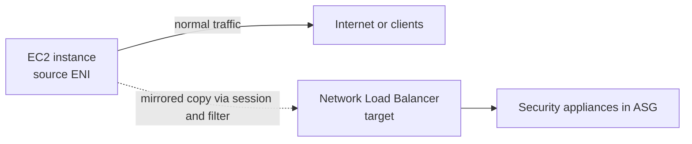
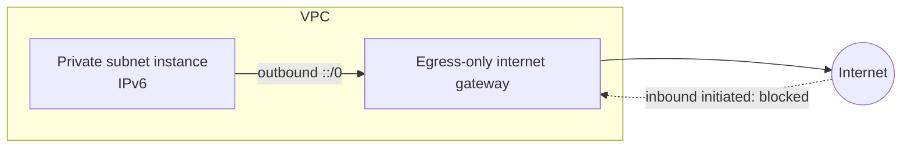

# VPC Monitoring, IPv6 & Network Firewall

Concept-only note: VPC Flow Logs, Traffic Mirroring, IPv6 in a VPC, Egress-Only Internet Gateway, networking costs and AWS Network Firewall. Lab steps are in [[27 - Networking - VPC]] (Version B). Related: [[VPC]], [[VPC Connectivity]].

## 1. VPC Flow Logs
(src: 27/23-VPC Flow Logs, 27/24-VPC Flow Logs Hands On + Athena)
- Capture **IP traffic metadata** at three levels: **VPC, subnet, ENI**. Used to monitor and troubleshoot connectivity.
- Destinations: **Amazon S3, CloudWatch Logs, Kinesis Data Firehose** (Firehose may be in the same or another account).
- Also captures traffic for **AWS-managed interfaces**: ELB, RDS, ElastiCache, Redshift, WorkSpaces, NAT gateway, transit gateway.
- Record fields: version, account ID, interface ID, source/destination address, source/destination port, protocol, packets, bytes, start/end, **action (ACCEPT/REJECT)**, log status. It is metadata, not payload.
- Uses: spot problematic IPs (repeatedly rejected, attackers), problematic ports, usage analytics, port scans, malicious behavior.
- Options when creating: **filter** (accept, reject or all), **maximum aggregation interval** (1 minute = more records and higher cost; **10 minutes** usually better).
- Querying: **Athena on S3** (best for bulk/batch analysis; table over the S3 prefix, partitions added manually, Glue can automate) or **CloudWatch Logs Insights** (streaming/near real-time).
- Permissions: for S3 a bucket policy is created automatically; for CloudWatch Logs an **IAM service role** trusted by `vpc-flow-logs.amazonaws.com` needs `logs:CreateLogGroup`, `logs:CreateLogStream`, `logs:PutLogEvents`.

### Troubleshooting SG vs NACL with the action field
Security groups are **stateful**, NACLs are **stateless**.

| Inbound | Outbound | Meaning |
|---|---|---|
| REJECT | - | NACL **or** security group is blocking |
| ACCEPT | REJECT | **NACL** issue (SG would auto-allow the reply) |
| - | REJECT (inbound ACCEPT) | **NACL** issue |
| REJECT (outbound ACCEPT) | ACCEPT | NACL issue (same logic for outgoing requests) |

### Architectures
- Flow logs -> CloudWatch Logs -> **Contributor Insights** = top 10 IPs/contributors of traffic.
- Flow logs -> CloudWatch Logs -> **metric filter** (e.g. SSH/RDP) -> **CloudWatch alarm** -> **SNS** alert.
- Flow logs -> S3 -> **Athena** (SQL) -> optionally **QuickSight** dashboards.

> [!warning] Correction [note]
> AWS confirms destinations CloudWatch Logs, S3 and Amazon Data Firehose, that flow log collection is outside the traffic path (no throughput/latency impact), and that vended-log charges apply. Source: [Logging IP traffic using VPC Flow Logs](https://docs.aws.amazon.com/vpc/latest/userguide/flow-logs.html).

> [!tip] Exam
> Inbound ACCEPT + outbound REJECT = NACL. Flow logs -> S3 + Athena for analysis; CloudWatch Logs for alarms. Needs an IAM role for CloudWatch Logs.

## 2. VPC Traffic Mirroring
(src: 27/30-VPC Traffic Mirroring)
- Capture and inspect network traffic **non-intrusively**: copy traffic from **source ENIs** to **targets** (an ENI or a **Network Load Balancer**) where security appliances you manage (often an ASG behind an NLB) analyze it.
- Optional **filter** to mirror only some traffic. Source instance is unaffected.
- Source and target can be in the **same VPC or different VPCs if VPC Peering is enabled**.
- Use cases: **content inspection, threat monitoring, network troubleshooting**.

> [!info] Diagram
> **Explanation:** A traffic mirror session ties a source ENI, an optional filter and a target. A copy of the packets goes to the NLB and the appliances behind it, while the instance keeps working normally.
> **Reference:** [What is Traffic Mirroring (Amazon VPC Traffic Mirroring Guide)](https://docs.aws.amazon.com/vpc/latest/mirroring/what-is-traffic-mirroring.html)

> [!tip] Exam
> "Capture and inspect traffic without disrupting the instance" -> Traffic Mirroring (source ENI -> NLB/ENI target).

## 3. IPv6 for VPC
(src: 27/31-IPv6 for VPC, 27/32-IPv6 for VPC - Hands On)
- IPv4 gives ~4.3 billion addresses and is exhausting; **IPv6** gives **3.4 x 10^38** addresses. Format: eight groups of hexadecimal (0000 to ffff); several short forms exist (recognize, do not memorize).
- **Every IPv6 address in AWS is public and internet-routable.**
- **IPv4 cannot be disabled** in a VPC/subnet. You can **add an IPv6 CIDR** (Amazon-provided or your own) to run **dual-stack**: instances get a private IPv4 **and** a public IPv6, and reach the internet via the **internet gateway** (supports IPv4 and IPv6).
- IPv6 CIDRs are assigned to the VPC and then to subnets; subnets can auto-assign IPv6. Security groups need IPv6 rules too (e.g. `::/0`). Route tables get a **local IPv6 route** automatically, so IPv6 traffic inside the VPC stays local.

> [!tip] Exam
> Cannot launch an instance in an IPv6-enabled VPC? It is **not** IPv6 exhaustion (huge space): it is **no free IPv4 addresses in the subnet**. Fix: **add a new IPv4 CIDR** to the VPC/subnet.

## 4. Egress-Only Internet Gateway
(src: 27/33-Egress Only Internet Gateway, 27/34-Egress Only Internet Gateway Hands On)
- **IPv6 only**; the IPv6 equivalent of a **NAT gateway**. Allows **outbound** IPv6 connections from the VPC and **blocks inbound** connections initiated from the internet.
- Requires a **route table update**: `::/0` -> egress-only internet gateway, in the **private** subnet's route table.

| Subnet | IPv4 route | IPv6 route |
|---|---|---|
| Public | `0.0.0.0/0` -> internet gateway | `::/0` -> internet gateway |
| Private | `0.0.0.0/0` -> NAT gateway | `::/0` -> egress-only internet gateway |
| Both | local IPv4 CIDR and local IPv6 CIDR -> local | |

> [!info] Diagram
> **Explanation:** The private subnet's route table sends IPv6 internet traffic to the egress-only gateway. Instances can start outbound connections and receive replies, but the internet cannot initiate connections to them.
> **Reference:** [Enable outbound IPv6 traffic using an egress-only internet gateway (Amazon VPC User Guide)](https://docs.aws.amazon.com/vpc/latest/userguide/egress-only-internet-gateway.html)

> [!warning] Correction [note]
> AWS confirms: IPv6 only, stateful, no charge for the gateway itself, route `::/0` to it, and that security groups cannot be attached to it (use NACLs on the subnet). Source: [Egress-only internet gateway](https://docs.aws.amazon.com/vpc/latest/userguide/egress-only-internet-gateway.html).

> [!tip] Exam
> IPv4 outbound-only = NAT gateway; IPv6 outbound-only = egress-only internet gateway.

## 5. Networking costs in AWS
(src: 27/37-Networking Costs in AWS)
Simplified, US-based per-GB figures from the lecture; the instructor notes numbers change over time and by region.

| Traffic | Cost |
|---|---|
| Inbound traffic into EC2 / data into AWS (ingress) | **free** |
| Two EC2 instances, **same AZ**, via **private IP** | **free** |
| Different AZs, same region, via **public/Elastic IP** | **$0.02/GB** |
| Different AZs, same region, via **private IP** | about half: **$0.01/GB** |
| Different regions | **$0.02/GB** |
| RDS read replica in same AZ vs different AZ | free vs **$0.01/GB** |

- Takeaways: use **private IPs** (cheaper, faster, stays on the AWS network); keep chatty clusters in **one AZ** for max savings at the cost of **high availability**; balance cost vs HA based on the exam question.
- **Egress** (AWS -> outside) is charged; **ingress** is usually free. Keep traffic inside AWS: e.g. run the app in AWS next to the database (same AZ) so a 100 MB query result is not pulled out; only the 50 KB result leaves.
- With **Direct Connect**, choose a location **co-located in the same region** for lower egress cost.

| S3 / CloudFront (US) | Cost |
|---|---|
| Data into S3 | free |
| S3 to internet | **$0.09/GB** |
| S3 Transfer Acceleration (50-500% faster) | extra **$0.04-$0.08/GB** |
| S3 to CloudFront | free |
| CloudFront to internet | **$0.085/GB**; requests about **7x cheaper** than S3 requests |
| S3 Cross-Region Replication | **$0.02/GB** |

- **NAT gateway vs gateway VPC endpoint to S3**: NAT gateway path = **$0.045/hour + $0.045/GB processed** (+ data transfer out cross-region, free in same region); **gateway endpoint = free** (instructor: ~$0.01/GB in/out in the same region), so endpoints are significantly cheaper.

[verify] Specific per-GB and per-hour prices above (NAT gateway $0.045, S3 egress $0.09, CloudFront $0.085, cross-AZ $0.01).
> [!warning] Correction [note]
> Prices not verified: could not confirm current values from an AWS page that I fetched, and the instructor says they vary over time and by region. Treat them as exam-level orders of magnitude. Confirmed only that gateway endpoints carry no additional charge ([Gateway endpoints](https://docs.aws.amazon.com/vpc/latest/privatelink/gateway-endpoints.html)) and that VPC peering data transfer within an AZ is free while cross-AZ/cross-region is charged ([What is VPC peering](https://docs.aws.amazon.com/vpc/latest/peering/what-is-vpc-peering.html)).

> [!tip] Exam
> Cheapest = same AZ + private IP. Prefer private IPs over public/Elastic IPs. Gateway endpoint beats NAT gateway for S3 cost. Traffic into AWS is free; out is charged.

## 6. AWS Network Firewall
(src: 27/38-AWS Network Firewall)
- Recap of protections: **NACL, security groups, AWS WAF** (malicious HTTP requests), **Shield / Shield Advanced** (DDoS), **Firewall Manager** (manage WAF/Shield rules across accounts).
- **AWS Network Firewall protects the entire VPC** from **Layer 3 to Layer 7**. Inspects traffic in **any direction**: VPC-to-VPC, outbound to internet, inbound from internet, to/from **Direct Connect** and **Site-to-Site VPN**.
- Internally uses **AWS Gateway Load Balancer**, but AWS manages the appliances (no third-party appliance to run).
- Rules can be **centrally managed across accounts and VPCs with AWS Firewall Manager**.
- Fine-grained controls: **thousands of rules**; filter by **IP and port** (tens of thousands of IPs), by **protocol** (e.g. block SMB outbound), by **domain** (allow only your domain or a given software repository), **regex pattern matching**. Actions: **allow, drop, or alert**.
- **Active flow inspection** = intrusion prevention (like GWLB, but managed). Rule matches can be logged to **S3, CloudWatch Logs, Kinesis Data Firehose**.

[verify] "Network Firewall internally uses the Gateway Load Balancer."
> [!warning] Correction [note]
> The Network Firewall developer guide describes stateful (Suricata-based IPS), stateless rules, domain filtering and Firewall Manager support, and filtering at the VPC perimeter including internet gateway, NAT gateway, VPN and Direct Connect. It does not mention Gateway Load Balancer on the page I fetched, so that claim is unconfirmed. Source: [What is AWS Network Firewall](https://docs.aws.amazon.com/network-firewall/latest/developerguide/what-is-aws-network-firewall.html).

> [!tip] Exam
> Sophisticated VPC-wide filtering (L3-L7, domain/protocol/IP filtering, intrusion prevention) -> AWS Network Firewall.

## Not included here
- Hands-on narration of 27/24 (creating flow logs, S3/CloudWatch roles, Athena table/partitions), 27/32 (enabling IPv6 on VPC/subnets/instance, testing) and 27/34: see [[27 - Networking - VPC]].
- 27/35 Section Cleanup (admin only).
- All lectures in scope had transcripts.
