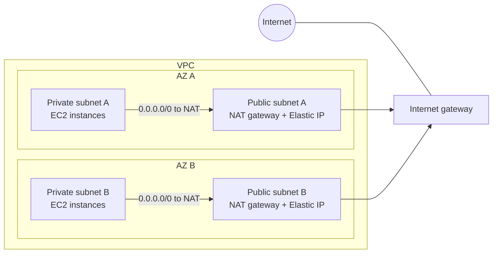

# Amazon VPC (Virtual Private Cloud)

Concept-only note covering the VPC core: CIDR, VPC, subnets, route tables, internet gateway, bastion host, NAT, NACL vs security group. Lab steps are in [[27 - Networking - VPC]] (Version B). Peering, endpoints, VPN, Direct Connect, Transit Gateway: [[VPC Connectivity]]. Flow Logs, Traffic Mirroring, IPv6, egress-only IGW, Network Firewall, costs: [[VPC Monitoring, IPv6 & Network Firewall]].

## 1. CIDR and private vs public IPv4
(src: 27/02-CIDR, Private vs Public IP)
- **CIDR** (Classless Inter-Domain Routing) = method to allocate IP ranges, written **base IP / subnet mask**. Base IP is an address in the range (usually the first); the mask says how many bits can change. Seen already in security group rules (`/32` = one IP, `0.0.0.0/0` = all IPs).
- Form used in AWS and this course: `/n` (e.g. `/8` = mask 255.0.0.0, `/16` = 255.255.0.0).
- An IP has 4 octets: `/32` no octet changes, `/24` last octet, `/16` last two, `/8` last three, `/0` all.
- Size = 2^(32 - n):

| CIDR | IPs | Note |
|---|---|---|
| /32 | 1 | single IP |
| /31 | 2 | |
| /30 | 4 | |
| /29 | 8 | |
| /28 | 16 | |
| /27 | 32 | |
| /26 | 64 | |
| /25 | 128 | |
| /24 | 256 | last octet .0 to .255 |
| /20 | 4,096 | (used in hands-on, e.g. 10.0.16.0/20 = .16.0 to .31.255) |
| /16 | 65,536 | last two octets change |
| /0 | all IPv4 | |

- Quick answers: 192.168.0.0/24 = 256 IPs; 192.168.0.0/16 = 65,536; x.x.x.x/32 = 1; 0.0.0.0/0 = all IPv4. A CIDR-to-range calculator website helps when in doubt.
- **Private IPv4 ranges** (IANA, for private LANs only; everything else is public internet):

| Range | Typical use |
|---|---|
| `10.0.0.0/8` | big networks (lots of IPs) |
| `172.16.0.0/12` | AWS **default VPC** range falls here |
| `192.168.0.0/16` | home networks |

> [!tip] Exam
> Know how to read a CIDR: /24 = 256, /16 = 65,536, /32 = 1, /0 = everything. The three private ranges above.

## 2. Default VPC
(src: 27/03-Default VPC Overview)
- Every new account has a **default VPC** so you can launch EC2 right away; instances land in it when no subnet is specified.
- Has **internet connectivity**; each EC2 instance gets a **public IPv4** plus public and private IPv4 DNS names.
- Comes with **one subnet per AZ** (three in the lecture's region), each with its own CIDR, **auto-assign public IPv4 = enabled**, the **main route table**, and the **default NACL** (all traffic allowed in and out). Its main route table sends everything outside the VPC CIDR to an **internet gateway attached to the VPC**.
- The main route table is implicitly associated with subnets that have no explicit association.
- A /20-sized default subnet has 4,096 addresses but shows **4,091 available** (5 reserved, see section 4).
- Best practice: create **your own VPCs** for production instead of using the default VPC.

## 3. VPC basics and limits
(src: 27/04-VPC Overview, 27/05-VPC Hands On [concepts only])
- VPC = **Virtual Private Cloud**, a regional resource; several VPCs per region allowed.
- Limits as given: **5 VPCs per region (soft limit)**, **5 CIDRs per VPC**, each CIDR **min /28 (16 IPs)** to **max /16 (65,536 IPs)**. Only **private IPv4 ranges** allowed for a VPC CIDR. `/15` is too big.
- A VPC can get **secondary IPv4 CIDRs** (up to 5 total) and IPv6 CIDRs after creation.
- **Tenancy**: Default (shared hardware) or Dedicated (dedicated hardware, very expensive).
- Creating a VPC also creates a **main route table** and a **main NACL**.
- CIDR design rule: **do not overlap** with other VPCs or corporate networks you may connect later (peering, VPN).

[verify] "5 VPCs per Region, 5 CIDRs per VPC, only private IPv4 ranges allowed."
> [!warning] Correction [note]
> AWS quotas confirm 5 VPCs per Region (adjustable) and 5 IPv4 CIDR blocks per VPC (adjustable up to 50); IPv6 CIDRs also 5. The "only private ranges" statement was not checked against a source and is unconfirmed. Sources: [Amazon VPC quotas](https://docs.aws.amazon.com/vpc/latest/userguide/amazon-vpc-limits.html), [Subnet CIDR blocks](https://docs.aws.amazon.com/vpc/latest/userguide/subnet-sizing.html) (subnet size /28 to /16 confirmed).

> [!tip] Exam
> VPC CIDR: /28 to /16, up to 5 CIDRs, 5 VPCs per region (soft). Plan non-overlapping CIDRs.

## 4. Subnets
(src: 27/06-Subnet Overview, 27/07-Subnet Hands On [concepts only])
- A subnet is a sub-range of the VPC CIDR, **tied to one AZ**. Subnets in a VPC must not overlap. Spread subnets across AZs for high availability.
- **5 IPs reserved per subnet** (first four and last one), not assignable to instances. For `10.0.0.0/24`:

| Address | Reserved for |
|---|---|
| 10.0.0.0 | network address |
| 10.0.0.1 | VPC router |
| 10.0.0.2 | Amazon-provided DNS |
| 10.0.0.3 | future use |
| 10.0.0.255 | broadcast (not supported in a VPC, so reserved) |

- Usable IPs = CIDR size - 5 (/24 = 251; /20 = 4,091).
- Design: **public subnets** small (load balancers, front-facing); **private subnets** larger (bulk of resources).
- Subnets look identical until route tables and an internet gateway make one public. The **auto-assign public IPv4** subnet setting is what gives instances a public IP (off by default in custom VPC subnets, on in default VPC).

> [!tip] Exam
> Need 29 IPs for EC2? /27 = 32 - 5 = 27 (too few). Choose **/26** (64 - 5 = 59).

## 5. Internet gateway and route tables
(src: 27/08-Internet Gateways & Route Tables, 27/09-... Hands On [concepts only], 27/36-VPC Section Summary)
- **Internet Gateway (IGW)**: lets VPC resources reach the internet; **horizontally scaled, highly available, redundant, managed**; created separately from the VPC; **one VPC <-> one IGW** (1:1).
- An IGW alone gives no internet access: you must also **edit route tables**.
- **Route table** = rules that steer traffic in the VPC. Default entry: VPC CIDR -> **local**. Add `0.0.0.0/0` -> IGW to make a subnet **public**. Targets can also be IGW, peering connections, VPC endpoints, NAT, etc.
- **Public subnet** = route to an IGW (and a public IP on the instance). **Private subnet** = no such route.
- A subnet uses its **explicitly associated** route table, else the **main route table**. Good practice: make explicit associations (separate public and private route tables), keep the main one unused.
- Having a public IP but no IGW route = no connectivity (instance public IP alone is not enough).

> [!tip] Exam
> Public subnet = IGW attached to the VPC + route `0.0.0.0/0` -> IGW. Both are required.

## 6. Bastion host
(src: 27/10-Bastion Hosts, 27/11 hands-on only)
- A **bastion host** is an EC2 instance in a **public subnet** used to SSH into EC2 instances in **private subnets** (you SSH to the bastion, then SSH onward over private IPs).
- Security groups (exam favourite):
  - **Bastion SG**: allow port 22 from the internet, but **restrict to your corporate/public CIDR**, not everywhere (security risk).
  - **Private instance SG**: allow port 22 from the **bastion's private IP or its security group**, because traffic originates from the bastion.
- A private instance cannot use EC2 Instance Connect through the internet unless made public; the bastion keeps it private.
- A private instance with only a bastion has **no outbound internet** until a NAT is added.

> [!tip] Exam
> Bastion in public subnet, locked-down SSH source; private SG references bastion SG on port 22.

## 7. NAT instance (legacy)
(src: 27/12-NAT Instances, 27/13 hands-on only)
- NAT = Network Address Translation: rewrites packet source/destination so **private-subnet instances can reach the internet** without being reachable from it.
- Flow: private instance -> route table -> NAT instance (public subnet) -> IGW -> internet. The NAT instance replaces the source private IP with its own public (Elastic) IP and maps replies back.
- Requirements: launched in a **public subnet**; **source/destination check disabled** (it forwards traffic not addressed to/from itself); **fixed Elastic IP**; private route table sends `0.0.0.0/0` to the NAT instance; its **security group** must allow e.g. HTTP/HTTPS (and ICMP for ping) from the private subnets, and outbound.
- Drawbacks: **not highly available out of the box** (need multiple in several AZs, ASG, failover script); bandwidth depends on instance type; you manage patches and security groups. Pre-configured Amazon Linux NAT AMI **reached end of standard support on 31 Dec 2020**; NAT gateways are recommended. Still tested on the exam.
- A route pointing to a stopped NAT instance shows as a **black hole** (inactive rule).

[verify] "The NAT instance AMI reached end of standard support on December 31st, 2020."
> [!warning] Correction [note]
> Not confirmed: the AWS NAT comparison page I fetched does not mention AMI support dates and only says NAT gateways are recommended for better availability, bandwidth and lower effort. Source: [Compare NAT gateways and NAT instances](https://docs.aws.amazon.com/vpc/latest/userguide/vpc-nat-comparison.html).

## 8. NAT gateway
(src: 27/14-NAT Gateways, 27/15 hands-on only, 27/36)
- **Managed by AWS**, higher bandwidth, built-in redundancy in its AZ, no administration. Pay **per hour + per GB of data processed**.
- Created in a **specific AZ** in a **public subnet**, uses an **Elastic IP** (public connectivity type); private route table sends `0.0.0.0/0` to it. Path: private subnet -> NAT gateway -> **IGW** -> internet. **Cannot work without an IGW.**
- Cannot serve instances in its own subnet (used from **other subnets**).
- **Bandwidth 5 Gbps, auto-scaling up to 100 Gbps.**
- **No security groups** to manage (not required). Cannot be used as a bastion host.
- **HA**: resilient only **within one AZ**; for AZ fault tolerance create **one NAT gateway per AZ** and route each AZ's private subnet to its own. No cross-AZ routing needed because if an AZ fails its instances are gone too.
- For IPv4 targets; for IPv6 outbound see the egress-only IGW in [[VPC Monitoring, IPv6 & Network Firewall]].

> [!info] Diagram
> **Explanation:** Each private subnet's route table sends internet-bound traffic to the NAT gateway in the public subnet of its own AZ; the NAT gateway forwards it through the IGW. One NAT gateway per AZ keeps an AZ failure from cutting off the other AZ. Inbound connections from the internet to the private instances are not possible.
> **Reference:** [NAT gateways (Amazon VPC User Guide)](https://docs.aws.amazon.com/vpc/latest/userguide/vpc-nat-gateway.html) and [Compare NAT gateways and NAT instances](https://docs.aws.amazon.com/vpc/latest/userguide/vpc-nat-comparison.html) (create a NAT gateway in each AZ for zone-independent architecture).

[verify] "NAT gateway bandwidth is 5 Gbps, scaling to 100 Gbps."
> [!warning] Correction [note]
> The 100 Gbps upper bound is confirmed (NAT gateways "scale up to 100 Gbps"). The 5 Gbps starting figure was not found on the fetched page and is unconfirmed. Source: [Compare NAT gateways and NAT instances](https://docs.aws.amazon.com/vpc/latest/userguide/vpc-nat-comparison.html).

### NAT gateway vs NAT instance

| Attribute | NAT gateway | NAT instance |
|---|---|---|
| Availability | HA within an AZ; one per AZ for multi-AZ | you script failover |
| Bandwidth | 5 to 100 Gbps (see note above) | depends on instance type |
| Maintenance | AWS managed | you patch OS/software |
| Cost | per hour + data processed | per hour for the instance type + data transfer out |
| Public IP | Elastic IP | Elastic IP |
| Security groups | not used | must configure |
| Bastion host | no | possible |

> [!tip] Exam
> Prefer NAT gateway (managed, scalable). One per AZ for HA. Needs an IGW. NAT instance needs source/destination check disabled.

## 9. Regional NAT gateway
(src: 27/16-Regional NAT Gateway)
- Newer NAT gateway type that is **highly available and associated directly with the VPC** (not a specific subnet/AZ).
- Create it at **VPC level**, route its internet traffic to the **IGW** via route table; **shared across all AZs**, automatically expands when you add private subnets in another AZ.
- No need for **public subnets** to host it, so no stray resources in public subnets; private subnets point to it via route table.
- Simplifies design: **one central NAT gateway per VPC** instead of one per AZ.

> [!warning] Correction [note]
> Existence of a regional NAT gateway with automatic multi-AZ expansion is confirmed by AWS (page "Regional NAT gateways for automatic multi-AZ expansion" in the NAT gateway docs). Details beyond the lecture were not fetched. Source: [NAT gateways](https://docs.aws.amazon.com/vpc/latest/userguide/vpc-nat-gateway.html).

## 10. Security groups vs NACLs
(src: 27/17-NACL & Security Groups, 27/18-NACL & Security Groups Hands On [concepts only])
**Request path (inbound)**: NACL (subnet) inbound -> security group inbound -> instance. **Outbound**: security group outbound -> NACL outbound.
- **Security group = stateful**: if inbound is allowed, the return traffic is automatically allowed regardless of outbound rules (and vice versa).
- **NACL = stateless**: inbound **and** outbound rules are always both evaluated (return traffic needs its own rule).

### Network ACL (NACL)
- Firewall at **subnet level**; **one NACL per subnet**; a new subnet gets the **default NACL**. One NACL can serve many subnets.
- Rules: **numbered 1 to 32,000**, **lowest number = highest priority, first match wins**, **allow and deny** rules. Last rule `*` denies anything unmatched. [verify]
> [!warning] Correction [note]
> AWS documentation states each NACL rule has a number from **1 to 32766** (the lecture's 32,000 is an approximation); evaluation order is unchanged. Source: [Control subnet traffic with network access control lists](https://docs.aws.amazon.com/vpc/latest/userguide/vpc-network-acls.html).
- Example: allow a CIDR at rule 100 and deny it at 200 -> **allowed** (100 wins). Deny at rule 80 beats allow at 100 -> blocked.
- AWS recommends numbering in **increments of 100** to leave room to insert rules.
- A **newly created custom NACL denies everything** by default.
- **Default NACL**: allows **all inbound and outbound** for associated subnets; do not modify it, create a custom one instead.
- Great for **blocking a specific IP** at subnet level.
- If a security group looks fine but traffic fails, **check the NACL** too (and vice versa).
- Blocked by NACL typically shows as a **timeout**.

### Ephemeral ports
- A client connects to a server's fixed port (80, 443, 22, 3306...) and opens a random **ephemeral port** on itself for the reply; the server answers to that port. It lives as long as the connection.
- Ranges by OS: **Windows 10: 49,152-65,535**; **Linux: 32,768-60,999** (the lecture uses 1024-65,535 as a NACL range).
- NACL example (web subnet <-> DB subnet, MySQL 3306):
  - web NACL outbound: TCP 3306 to DB CIDR; DB NACL inbound: TCP 3306 from web CIDR;
  - **reply path**: DB NACL outbound: TCP **ephemeral range** to web CIDR; web NACL inbound: TCP ephemeral range from DB CIDR.
- With several subnets/NACLs, **every subnet-to-subnet combination** must be allowed (rules use CIDRs), so update NACL rules when adding subnets.

### Comparison

| | Security group | NACL |
|---|---|---|
| Level | **instance** (ENI) | **subnet** |
| Rules | **allow only** | **allow and deny** |
| State | **stateful** | **stateless** |
| Evaluation | **all rules** evaluated | **in number order, first match wins** |
| Applies to | instances it is assigned to | **all instances** in associated subnets |

[verify] "NACL rule numbers go from 1 to 32,000."
> [!warning] Correction [note]
> Unconfirmed: the AWS quotas page lists a default of 20 rules per NACL (adjustable up to 40 inbound + 40 outbound) and 200 NACLs per VPC, but does not state the rule-number ceiling. Source: [Amazon VPC quotas](https://docs.aws.amazon.com/vpc/latest/userguide/amazon-vpc-limits.html).

> [!tip] Exam
> SG = instance, allow-only, stateful, all rules. NACL = subnet, allow+deny, stateless, first match by number; default NACL allows all; custom NACL denies all; remember ephemeral ports. Block one IP -> NACL.

## 11. Section recap (core VPC pieces)
(src: 27/36-VPC Section Summary)
- CIDR = IP range. VPC works for IPv4 and IPv6. Subnets are AZ-bound, public or private.
- Public subnet = IGW + route to it. Route tables also point to peering connections, endpoints, etc.
- Bastion host = public EC2 for SSH into private instances. NAT instance = old; needs source/dest check disabled. NAT gateway = managed, scalable, IPv4 targets.
- NACL = stateless subnet firewall (mind ephemeral ports); security group = stateful instance firewall.
- Later topics (peering is non-transitive and needs non-overlapping CIDRs; endpoints: gateway for S3/DynamoDB, interface for the rest; Flow Logs at VPC/subnet/ENI level; Site-to-Site VPN with VGW and CGW, VPN CloudHub; Direct Connect and DX Gateway; PrivateLink; Transit Gateway; Traffic Mirroring; egress-only IGW) are in [[VPC Connectivity]] and [[VPC Monitoring, IPv6 & Network Firewall]].

## Not included here
- Hands-on lectures (27/05, 07, 09, 11, 13, 15, 18) only mined for concepts; steps are in [[27 - Networking - VPC]].
- 27/01-Section Introduction: logistics only (cost warning for NAT gateway: do the section in one go and delete resources).
- 27/19-22, 25-29 -> [[VPC Connectivity]]; 27/23-24, 30-35, 37-38 -> [[VPC Monitoring, IPv6 & Network Firewall]].
- All lectures in this scope had transcripts.
