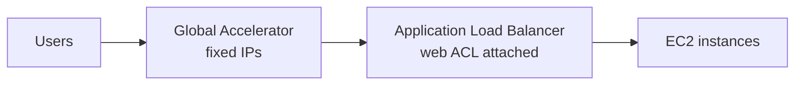
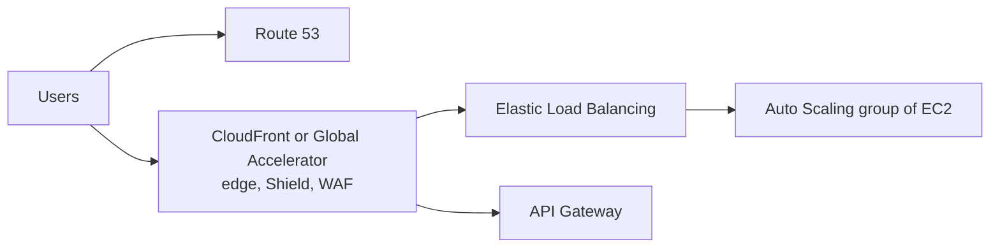

# WAF, Shield & Firewall Manager

Concept-only note on AWS WAF, AWS Shield, AWS Firewall Manager and DDoS-resilient architecture. The console tour (26/17) is reduced to its concepts and prices; see [[26 - Security & Encryption]] (Version B) for the lab narration.

## 1. AWS WAF (Web Application Firewall)
(src: 26/14-Web Application Firewall (WAF), 26/17-WAF & Shield - Hands On)
- Protects web apps from common web exploits at **Layer 7 (HTTP)**; Layer 4 is TCP/UDP.
- Deployable on: **Application Load Balancer, API Gateway, CloudFront, AppSync GraphQL API, Cognito user pool**. **Not on Network Load Balancer** (Layer 4); the exam tries to trick you here.
- You define a **web ACL** (access control list) with rules:
  - **IP set**: up to **10,000 IPs** each; use multiple rules for more;
  - HTTP **headers, body, URI strings**: SQL injection, cross-site scripting (XSS);
  - **size constraints** (e.g. max 2 MB request);
  - **geo match**: allow/block countries;
  - **rate-based rules**: count requests per IP for DDoS protection (e.g. no more than 10 per second per IP).
- Web ACLs are **regional**, except for **CloudFront (global)**. A **rule group** = reusable set of rules added to many web ACLs.
- Rule sources in the console: custom rules (IP, geo, rate), **AWS managed rules** (free ones, e.g. PHP/injection protection) and **paid** managed rules (bot control, account takeover prevention, layer 7 attacks).
- Cost cues from the demo: a web ACL is **$5 per month**; paid managed rule groups add per-request cost.

[verify] Protectable resources list (ALB, API Gateway, CloudFront, AppSync, Cognito).
> [!warning] Correction [note]
> AWS's current WAF documentation also lists **AWS App Runner service, AWS Verified Access instance, AWS Amplify** (and others) as protectable resources; ALB, API Gateway REST API, CloudFront, AppSync and Cognito are confirmed. NLB is not on the list. Pricing: web ACL $5.00/month, $1.00/month per rule, $0.60 per million requests (Bot Control and others extra). Sources: [AWS WAF developer guide](https://docs.aws.amazon.com/waf/latest/developerguide/waf-chapter.html), [AWS WAF pricing](https://aws.amazon.com/waf/pricing/).

### Fixed IP with WAF
- WAF needs an **ALB**, but an ALB has **no fixed IP**. Solution: put **Global Accelerator** in front of the ALB (fixed IPs) and attach the **web ACL to the ALB** in the same Region ([[CloudFront & Global Accelerator]], [[ELB]]).

> [!info] Diagram
> **Explanation:** Global Accelerator provides static anycast IPs; it forwards to the ALB, where the WAF web ACL (same Region as the ALB) filters Layer 7 requests before they reach the instances. NLB cannot be used because WAF does not support it.
> **Reference:** [AWS WAF developer guide - supported resource types](https://docs.aws.amazon.com/waf/latest/developerguide/waf-chapter.html) (confirms ALB support and no NLB; the Global Accelerator combination is from the lecture).

> [!tip] Exam
> WAF = Layer 7, web ACL, targets ALB / API Gateway / CloudFront / AppSync / Cognito (never NLB). Rate-based rule = DDoS/brute force per IP. Need fixed IP + WAF -> Global Accelerator + ALB.

## 2. AWS Shield (DDoS protection)
(src: 26/15-Shield - DDoS Protection, 26/17)
- **DDoS** = distributed denial of service: massive requests from many machines overwhelming your infrastructure.

| | Shield Standard | Shield Advanced |
|---|---|---|
| Cost | **Free**, enabled for every AWS customer | Optional, **~$3,000 / month per organization** |
| Protects against | SYN/UDP floods, reflection and other **Layer 3/4** attacks | More sophisticated DDoS on **EC2, ELB, CloudFront, Global Accelerator, Route 53** |
| Extras | - | **24/7 AWS DDoS Response Team (SRT)**; protection against **higher fees** caused by an attack; **automatic application-layer (Layer 7) mitigation** by creating/evaluating/deploying **WAF rules**; advanced reporting |

[verify] "Shield Advanced costs around $3,000 per month per organization."
> [!warning] Correction [note]
> AWS confirms a **$3,000 monthly fee with a 1-year subscription commitment** (auto-renewing), plus data-transfer-out usage fees for CloudFront, ELB, EC2 and Global Accelerator. Source: [AWS Shield pricing](https://aws.amazon.com/shield/pricing/).

## 3. AWS Firewall Manager
(src: 26/16-Firewall Manager, 26/17)
- Manages firewall rules **across all accounts of an AWS Organization** from one place ([[Organizations & Identity Federation]]).
- You create a **security policy** (common set of rules). Policies are created **per Region**, then applied to all accounts. Policy types:
  - **WAF** rules (ALB, API Gateway, CloudFront...);
  - **Shield Advanced** (ALB, CLB, NLB, Elastic IP, CloudFront);
  - **Security groups** (EC2, ALB, ENI in the VPC);
  - **AWS Network Firewall** (VPC level);
  - **Route 53 Resolver DNS Firewall**.
- **New resources are covered automatically** (e.g. a new ALB gets the existing WAF rule).
- Demo note: a Firewall Manager policy costs about **$100 per month** (unconfirmed, see below).

[verify] "A Firewall Manager policy costs about $100 per month."
> [!warning] Correction [note]
> Unconfirmed: I did not fetch a Firewall Manager pricing page.

### How WAF, Shield and Firewall Manager fit together
| Need | Use |
|---|---|
| Define web ACL rules for one-time/individual protection | **WAF** |
| Apply WAF (or other) rules across accounts and auto-protect new resources | **Firewall Manager** managing WAF |
| DDoS protection with SRT, reporting, auto WAF rules; frequent attacks | **Shield Advanced** (Firewall Manager can deploy it org-wide) |

> [!tip] Exam
> WAF protects applications individually, Shield protects against DDoS, Firewall Manager centralizes policies across the Organization. They are used together.

## 4. DDoS protection best practices (architecture)
(src: 26/18-DDoS Protection Best Practices)
The exam wants you to think in layers. Edge services are DDoS-protected and fully integrated with Shield.

- **Edge mitigation (BP1, BP3)**: **CloudFront** (web delivery at the edge, protection against SYN floods and UDP reflection via Shield), **Global Accelerator** (global edge access, useful when the backend is not compatible with CloudFront), **Route 53** (global DNS resolution at the edge with DDoS protection).
- **Infrastructure layer defense (BP1, BP3, BP6)**: CloudFront, Global Accelerator, Route 53 and ELB absorb traffic before it reaches EC2; **Auto Scaling** scales for extra load; **ELB** spreads traffic so each instance has a manageable share.
- **Application layer defense (BP1, BP2)**: CloudFront serves static content from the edge; **WAF** on CloudFront or ALB filters by request signature (IPs, request types), **rate-based rules** auto-block bad actors, managed rules block by IP reputation/anonymous IPs; CloudFront **geo restriction**; **Shield Advanced** auto-creates WAF rules for Layer 7.
- **Reduce attack surface (BP1, BP4, BP6)**: CloudFront, API Gateway or ELB **hide the backend** (attacker cannot tell Lambda vs EC2 vs ECS); **security groups and network ACLs** filter by IP; Elastic IPs can be protected by Shield Advanced.
- **Protect API endpoints**: API Gateway hides the backend; **edge-optimized** mode is already global, or use **CloudFront + regional** mode for more control; WAF on API Gateway filters HTTP requests; configure **burst limits**, **header filtering**, **API keys**.

> [!info] Diagram
> **Explanation:** Traffic first meets edge services (DNS, CloudFront or Global Accelerator with Shield and WAF), which absorb and filter attacks; the load balancer and Auto Scaling group behind them only see clean, manageable traffic; API Gateway offers the same hiding of the backend for APIs. Simplified from the lecture's reference architecture.
> **Reference:** [AWS Best Practices for DDoS Resiliency (AWS Whitepaper)](https://docs.aws.amazon.com/whitepapers/latest/aws-best-practices-ddos-resiliency/aws-best-practices-ddos-resiliency.html) (page confirmed; the BP numbering is the lecture's).

> [!tip] Exam
> Edge location services (CloudFront, Global Accelerator, Route 53) + Shield/WAF + ELB + Auto Scaling + hiding backend resources = the DDoS-resilient pattern. See [[CloudFront & Global Accelerator]], [[Route 53]], [[ELB]], [[VPC]].

## Not included here
- 26/17 WAF & Shield - Hands On: console tour narration dropped (protection pack wizard); concepts and costs merged above.
- 26/19-21 GuardDuty, Inspector & Macie -> [[GuardDuty, Inspector & Macie]].
- No lecture here lacks a transcript.
